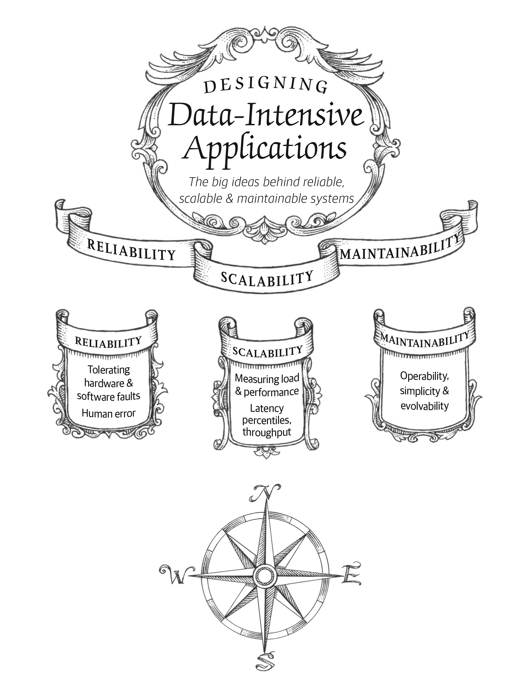

<table style="width:100%">
  <tr>
    <td></td>
    <td></td>
    <td></td>
    <td></td>
  </tr>
  <tr>
    <td></td>
    <td></td>
    <td></td>
    <td></td>
  </tr>
  <tr>
    <td></td>
    <td></td>
    <td></td>
    <td></td>
  </tr>
</table>

  <a href="https://www.oreilly.com/library/view/designing-data-intensive-applications/9781491903063/">Designing Data Intensive Applications</a> by <a href="https://twitter.com/martinkl">Martin Kleppmann</a> © O’Reilly Media, Inc.

